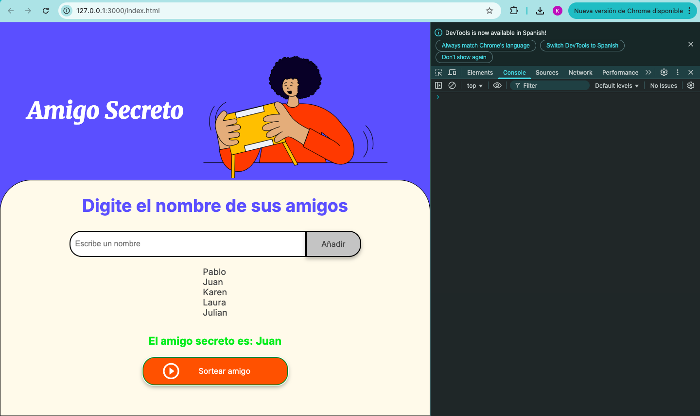

# 🎁 Amigo Secreto

Este proyecto permite a los usuarios agregar nombres y sortear un amigo secreto de manera aleatoria.

## 🚀 Cómo usar el proyecto

1. Ingresa el nombre de los participantes en el campo de texto.
2. Presiona "Añadir" para agregarlos a la lista.
3. Cuando estén todos los nombres, presiona "Sortear".
4. Aparecerá un mensaje con el amigo secreto seleccionado.

## 🖼️ Capturas de pantalla

## 🔧 Tecnologías utilizadas
- HTML
- CSS
- JavaScript

